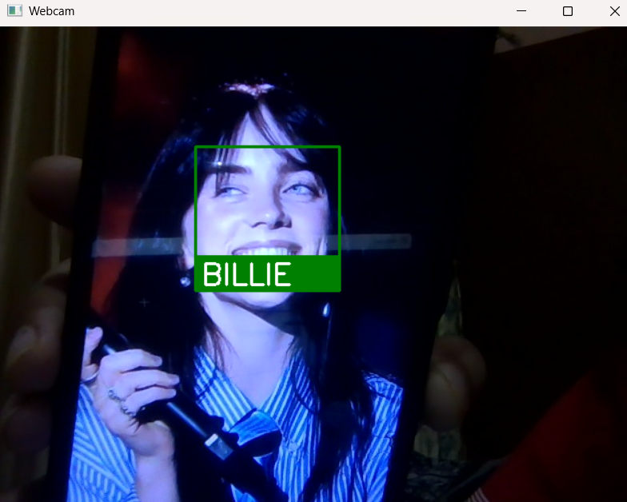
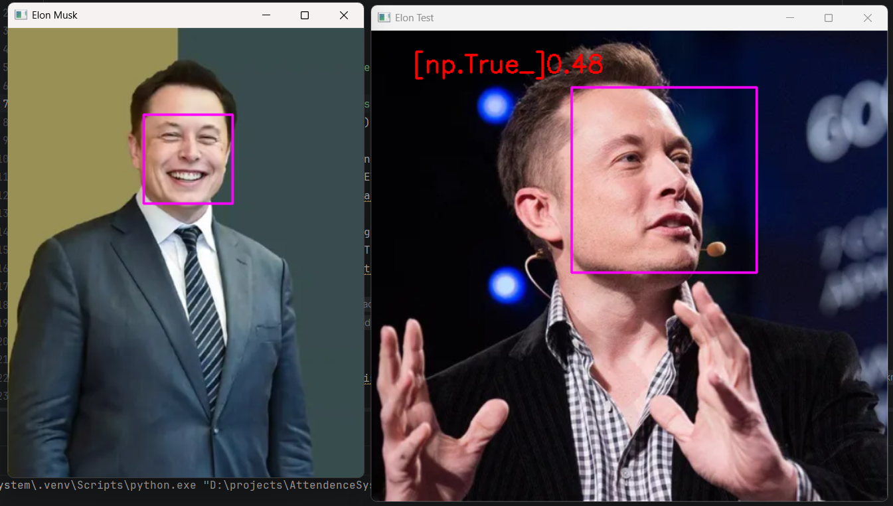
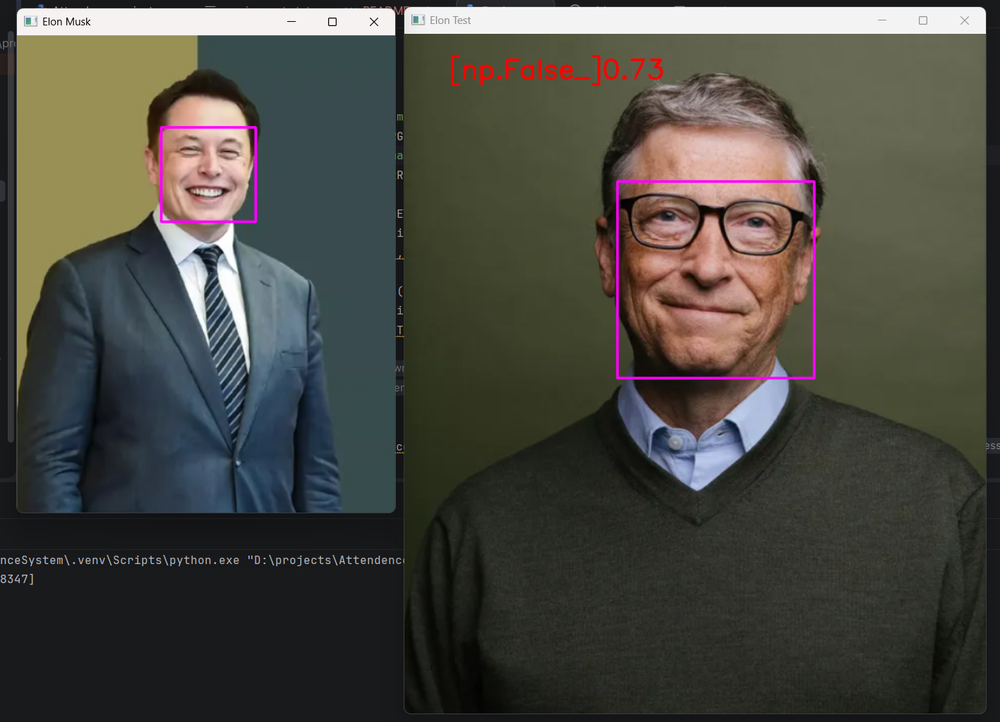

# Face Recognition Attendance System

A Python-based attendance system that uses face recognition to identify individuals and automatically mark their attendance.

## Overview

This project detects faces from images or webcam input, compares them with known faces, and records attendance in a CSV file. Duplicate entries are prevented so that attendance is marked only once per session.

## Features

- Face detection and recognition
- Attendance marking using CSV
- Duplicate attendance prevention
- OpenCV integration
- Easy to extend for real-time webcam attendance

## Technologies Used

- Python
- OpenCV
- face_recognition
- NumPy
- dlib

## Project Structure
```text
Face-Recognition-Attendance-System/
│
├── ImagesAttendance/
│ ├── taylor.png
│ └── ...
│
├── assets/
│   ├── workflow.png
│   └── ...
│  
│
├── Attendenceproject.py
├── attendence.csv
├── requirements.txt
└── README.md
```
## How It Works
1. Load known face images.
2. Generate face encodings.
3. Detect faces in a test image or webcam frame.
4. Compare detected faces with stored encodings and find distance.
5. Update the name with lowest distance face/person.
6. Mark attendance in the CSV file if the person has not already been recorded.


## Working Demonstration

### Known Face


### Face Match Result



## Face Distance Calculation
```text
The system converts each detected face into a 128-dimensional face encoding using the `face_recognition` library.

To compare two faces, the Euclidean distance between their encodings is calculated.

Distance Interpretation:

| Face Distance | Result |
|--------------|---------|
| 0.00 - 0.40 | Very Strong Match |
| 0.40 - 0.60 | Match |
| > 0.60 | Different Person |

The lower the distance, the more similar the faces are.

Example:

Known Face: Elon Musk 
Test Face: Elon Musk

Face Distance = 0.37

Result: Match
```
<p align="center">
  
  
</p>


## Installation

```bash
git clone <https://github.com/manishaadhikari01/Face-Recognition-Attendance-System.git>
cd Face-Recognition-Attendance-System

pip install -r requirements.txt

